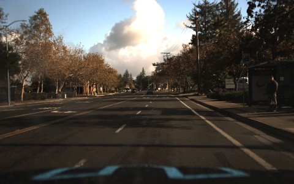
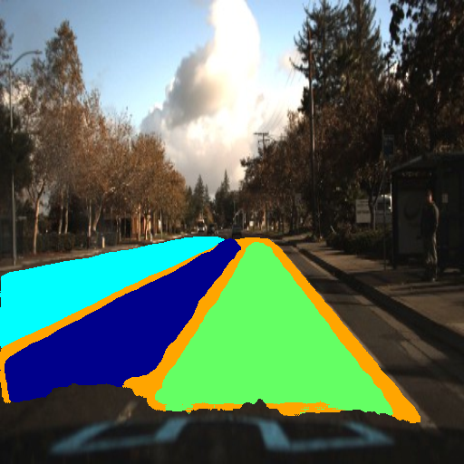

# Lane Detection using CNN 
This project focuses on semantic lane segmentation using a U-Net architecture tailored for Indian road conditions. The model is trained on a custom annotated dataset where each pixel is classified into multiple lane categories. U-Net is chosen for its encoder-decoder design, making it ideal for pixel-level segmentation tasks.

The training pipeline supports:

- Multi-class segmentation
- Extensive metric evaluation (Pixel Accuracy, IoU, Precision, Recall, F1-score, Dice Coefficient)
- Automated plotting and saving of training metrics
- Final model saving and result visualization

# Architecture of the CNN model used


# Dependencies required:
```shell
pip install -r requirements.txt
```

# Libraries used:
1. torch==2.6.0
2. torchvision==0.21.0
3. numpy==1.26.4
4. Pillow==10.2.0
5. pyyaml==6.0.2
6. tqdm==4.66.6
7. matplotlib==3.8.4
8. scikit-learn==1.5.1
9. opencv-python==4.11.0.86
10. pandas==2.2.3

# Output
<table>
  <tr>
    <td></td>
    <td></td>
  </tr>
</table>


# Flow of the project
1. Load the Dataset
The dataset is stored in the data/processed/ directory and is already split into two sets:

2. Train and Validation Sets
- train/ contains:
    - images/ — input road images
    - masks/ — corresponding segmentation masks

- val/ contains:
    - images/ — input validation images
    - masks/ — corresponding masks for evaluation

3. Train the Model
Execute the training script, which:
- Loads the dataset
- Initializes the U-Net model
- Starts training and logs all metrics/graphs to the graphs/ folder

```shell
python train.py
```


